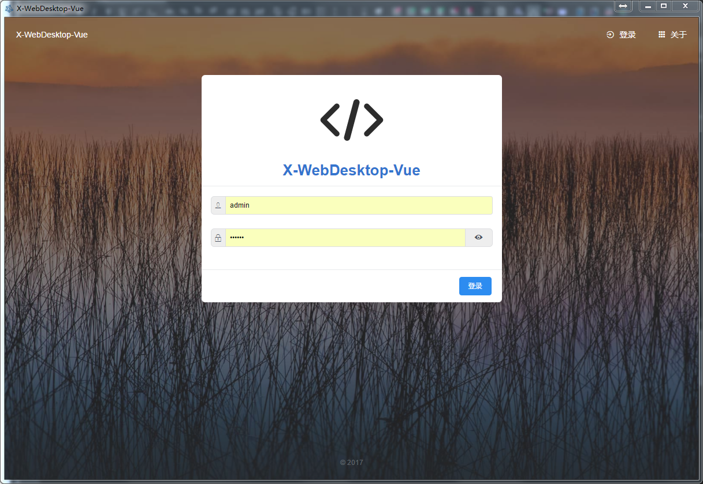

# X-WebDesktop-NW

基于 NW.js 的 WebDesktop 系统

核心内容： [X-Desktop-Vue](https://github.com/OXOYO/X-WebDesktop-Vue)

NW.js vue 脚手架：[vue-nw-seed](https://github.com/anchengjian/vue-nw-seed)

Web版本：[X-Desktop-Vue](https://github.com/OXOYO/X-WebDesktop-Vue)

API服务：[X-WebDesktop-Api-Koa](https://github.com/OXOYO/X-WebDesktop-Api-Koa)


特别鸣谢 [@anchengjian](https://github.com/anchengjian)


## Preview


## Start

```bash
  git clone
  npm i
  npm run dev
```
用户登录，需要 [X-WebDesktop-Api-Koa](https://github.com/OXOYO/X-WebDesktop-Api-Koa) 支持

账号：admin
密码：123456

## Build

```bash
  npm run build
```
